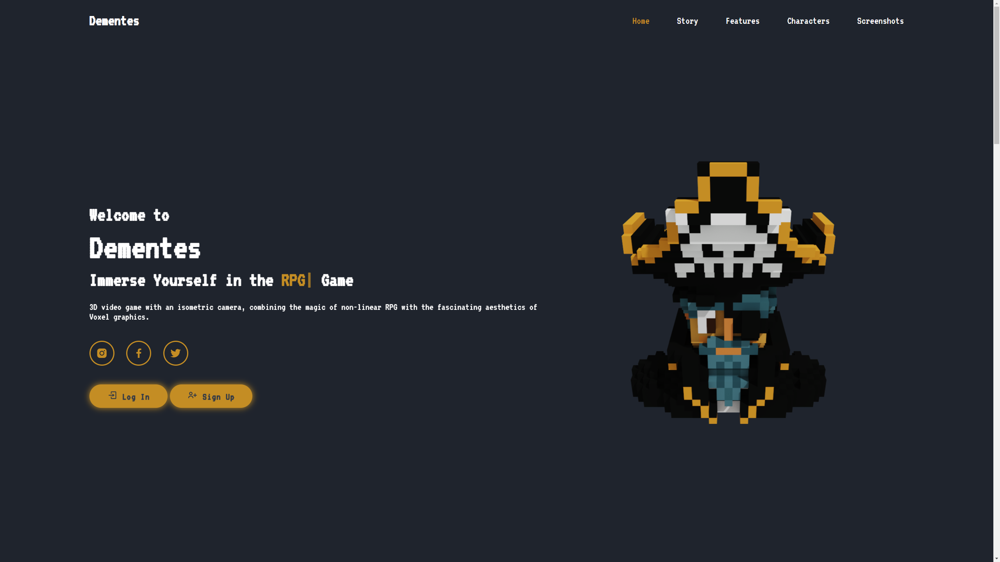

# Dementes Official Website

    

Welcome to the **official website of Dementes**, a 3D RPG game with voxel graphics and an isometric camera. This website was developed from scratch using **HTML, CSS, and JavaScript** for animations, and integrates **Firebase Realtime Database** to manage player data, characters, and statistics.

---

## 🌟 Features of the Website

- **Custom Design**: Fully responsive design for seamless access on all devices.
- **Interactive Animations**: Developed using JavaScript for dynamic and engaging user interactions.
- **Firebase Integration**: Manages player profiles, characters, and progress data securely in real-time.
- **Dedicated Game Sections**:
  - **Home**: Welcome players and introduce the game.
  - **Story**: Highlight the epic adventure of Dementes.
  - **Features**: Show off the unique mechanics and gameplay.
  - **Characters**: Display a rotating carousel of in-game characters.
  - **Screenshots**: A gallery showcasing the world, battles, and equipment.

---

## 🎮 About the Game

### 🕹️ Game Story
Embark on an epic adventure in a non-linear RPG world filled with magic, challenges, and surprises. Choose your own path:
- Become a **warrior**, **mage**, **archer**, **healer**, or **trader**.
- Engage in thrilling real-time combat against monsters and bosses.
- Progress and grow stronger with each victory, unlocking new powers.

Available for **Windows** and **Android**, with plans to support **iOS** in the future.

---

## 💻 Website Structure

### **Frontend**
- **HTML**: Structured and semantic content.
- **CSS**: Custom styles for a clean, modern look.
- **JavaScript**: Animations and interactive elements.

### **Backend**
- **Firebase Realtime Database**:
  - Stores player profiles, statistics, and character data.
  - Synchronizes game progress across platforms.

---

## 📷 Screenshots

    
    
    

### World and Environments
Explore a beautifully crafted voxel world where every block holds potential for adventure.

    

### Equipment and Weapons
Customize your character with a wide variety of weapons and equipment.

    

### Real-Time Combat
Face terrifying monsters and challenging bosses in strategic, real-time battles.

    

### Strategic Combat
Use verticality and strategy to gain an edge in battle.

    

### Level Up
Level up your character and unlock new powers to dominate the battlefield.

    

### Interact with NPCs
Engage with NPCs to negotiate, gather quests, and evolve your story.

    

---

## 🔗 Links
- Visit the **[official game website](https://dementesgame.com)**.
- Download the game on the **[Google Play Store](https://play.google.com/store/apps/details?id=com.CodesignProjects.Dementes)**.

---

## 📜 Copyright
Copyright © 2023-2025 by Alejandro Martinez. All rights reserved.
